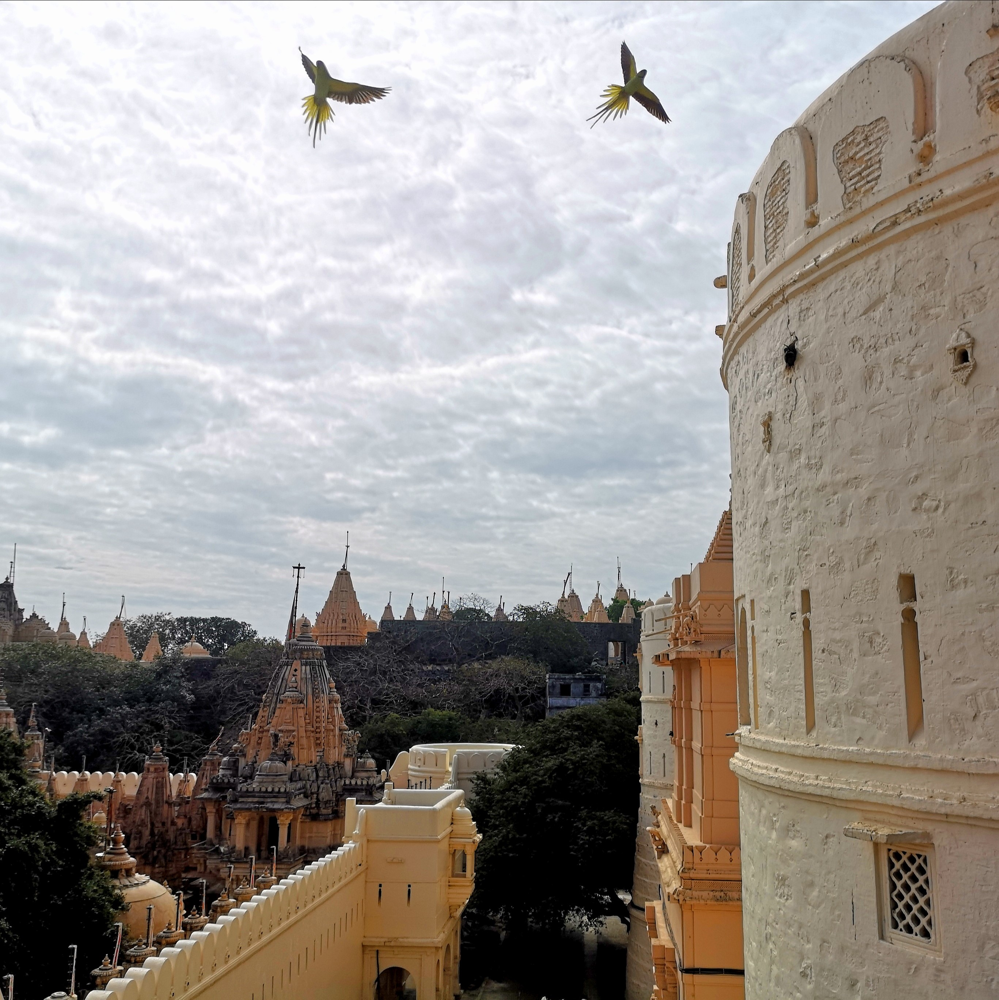

# The Pāṇinī Machine

> This whole universe would be blinded by darkness 
>
> If the luminous rays called "speech" did not shine. 
>
> Daṇḍin's _Mirror on Poetry_

\_\_

> इदम् अन्धं तमः कृत्स्नं जायेत भुवनत्रयम् \| 
>
> यदि शब्दाह्वयं ज्योतिरासंसारं न दीप्यते \|\| 
>
> दण्डस्य काव्यदर्शः

> idam andhaṃ tamaḥ kṛtsnaṃ jāyeta bhuvanatrayam \| 
>
> yadi śabdāhvayaṃ jyotirāsaṃsāraṃ na dīpyate \|\| 
>
> Kāvyadarśa of Daṇḍin

